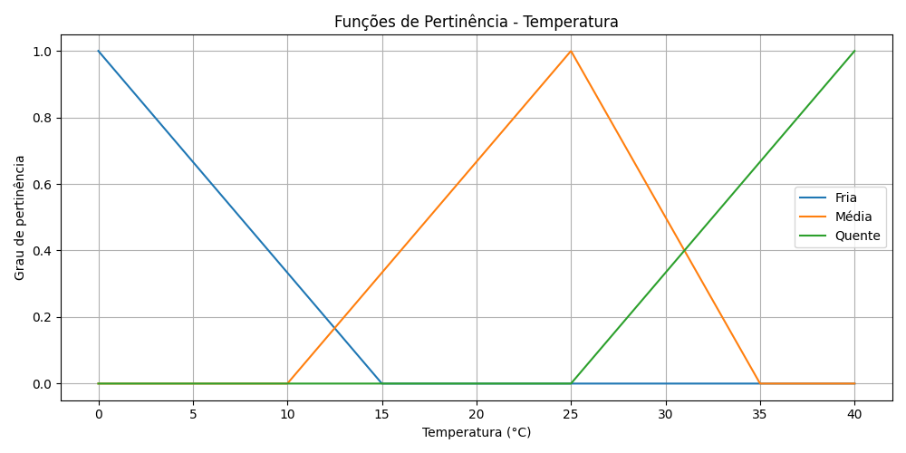
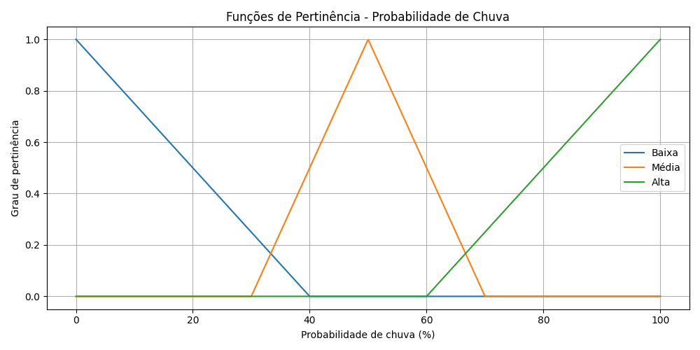
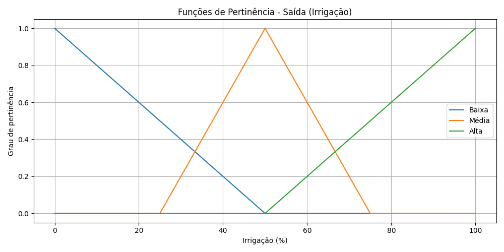
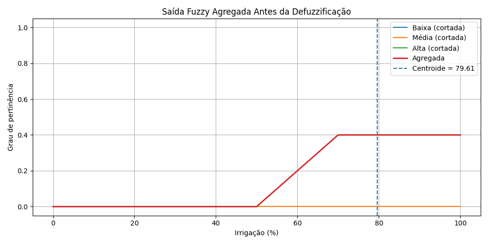
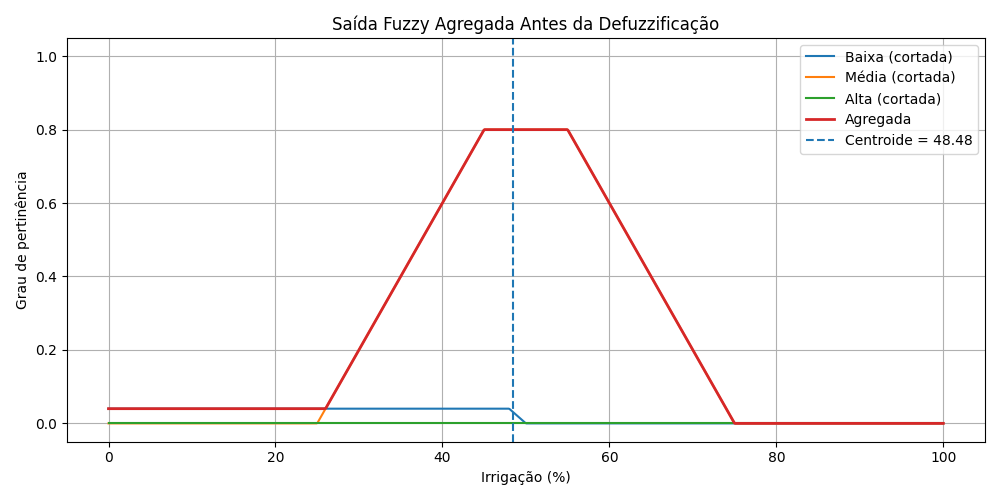
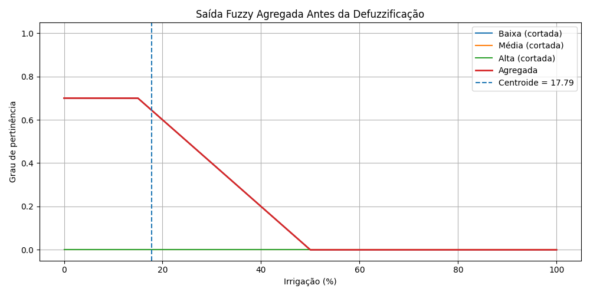

<p align="center"> 
  
</p>

<h1 align="center">
Mamdani Fuzzy Irrigation System
</h1>

<h3 align="center">
Implementação manual de um Sistema de Inferência Fuzzy do tipo Mamdani para controle inteligente de irrigação.
</h3>

<div align="center">


</div>

---

<div align="justify">
<p><strong>Disciplina:</strong> Inteligência Computacional<br>
<strong>Instituição:</strong> Centro Federal de Educação Tecnológica de Minas Gerais (CEFET-MG) - Campus V Divinópolis<br>
<strong>Professor:</strong> Alisson Marques da Silva<br>
<strong>Projeto:</strong> "Atividade - Sistema Fuzzy Linguístico"<br>
</div>


---


## Descrição do problema

O objetivo deste trabalho é desenvolver um sistema capaz de determinar a quantidade ideal de irrigação para uma plantação, considerando variáveis ambientais.

O sistema utiliza lógica fuzzy para lidar com incertezas e imprecisões, simulando decisões humanas em situações reais.

---

## Variáveis de entrada e saída

### Entradas:
- Umidade do solo (%)
- Temperatura (°C)
- Probabilidade de chuva (%)

### Saída:
- Quantidade de irrigação (%)

---

## Universos de discurso

| Variável | Intervalo |
|--------|----------|
| Umidade do solo | [0, 100] |
| Temperatura | [0, 40] |
| Probabilidade de chuva | [0, 100] |
| Irrigação | [0, 100] |

---

## Termos linguísticos

### Umidade do solo
- Baixa
- Média
- Alta

### Temperatura
- Fria
- Média
- Quente

### Probabilidade de chuva
- Baixa
- Média
- Alta

### Irrigação (saída)
- Baixa
- Média
- Alta

---

## Funções de pertinência

Foram utilizadas funções triangulares.

Exemplo:


$$
\mu(x) =
\begin{cases}
0, & \text{se } x \le a \text{ ou } x \ge c \\
\dfrac{x - a}{b - a}, & \text{se } a < x < b \\
\dfrac{c - x}{c - b}, & \text{se } b < x < c \\
1, & \text{se } x = b
\end{cases}
$$


As funções foram implementadas manualmente no arquivo:


`src/funcoes_pertinencia.py`


---

## Base de regras

O sistema utiliza as seguintes regras:

1. SE umidade baixa E temperatura quente → irrigação alta  
2. SE umidade baixa E temperatura média → irrigação média  
3. SE umidade baixa E temperatura fria → irrigação média  
4. SE umidade média E temperatura quente → irrigação média  
5. SE umidade média E temperatura média → irrigação média  
6. SE umidade média E temperatura fria → irrigação baixa  
7. SE umidade alta → irrigação baixa  
8. SE chuva alta → irrigação baixa  
9. SE chuva média E umidade baixa → irrigação média  
10. SE chuva baixa E temperatura quente → irrigação alta  
11. SE umidade média E chuva média → irrigação média  

---

## Método de inferência

O sistema utiliza o método de inferência fuzzy do tipo Mamdani, com as seguintes operações:

- Operador AND → mínimo (min)
- Agregação das saídas → máximo (max)
- Defuzzificação → método do centroide:

$$
y^* = \frac{\sum x \cdot \mu(x)}{\sum \mu(x)}
$$


---

## Valores de entrada testados

| Teste | Umidade | Temperatura | Chuva |
|------|--------|------------|------|
| 1 | 20 | 35 | 10 |
| 2 | 50 | 24 | 40 |
| 3 | 85 | 22 | 80 |

---

## Graus de pertinência (fuzzificação)

### Exemplo (Teste 2):

- u_media = 1.0  
- t_media = 0.8  
- c_media = 0.6  

---

## Graus de ativação das regras

### Exemplo (Teste 2):

- r5 = min(1.0, 0.8) = 0.8  
- r11 = min(1.0, 0.6) = 0.6  

---

## Saída fuzzy agregada

A agregação combina as saídas de todas as regras, formando uma única função fuzzy de saída.

---

## Gráficos das funções de pertinência

Os gráficos a seguir representam as funções de pertinência utilizadas para modelar as variáveis do sistema fuzzy.

Arquivos:

### Umidade do solo


### Temperatura


### Probabilidade de chuva


### Saída (Irrigação)


---

## Gráfico da saída agregada

Para cada teste, foi gerado o gráfico da saída fuzzy agregada antes da defuzzificação:

### Teste 1


Neste cenário, o solo apresenta baixa umidade, temperatura elevada e baixa probabilidade de chuva.  
Observa-se predominância da região de alta irrigação, resultando em um valor final elevado (~79.61%).  
Isso confirma o comportamento esperado do sistema.

### Teste 2


Neste caso, as condições são intermediárias.  
A saída agregada apresenta maior contribuição da região média, com pequena influência da região baixa.  
O valor final (~48.48%) indica uma necessidade moderada de irrigação, coerente com o cenário.


### Teste 3


Neste cenário, o solo está úmido e há alta probabilidade de chuva.  
A saída agregada concentra-se na região de baixa irrigação, resultando em um valor final reduzido (~17.79%).  
Isso demonstra que o sistema reduz corretamente a irrigação em condições favoráveis.

---

## Resultados dos testes

| Teste | Saída (%) | Interpretação |
|------|----------|--------------|
| 1 | 79.61 | Alta |
| 2 | 48.48 | Média |
| 3 | 17.79 | Baixa |

Os resultados obtidos demonstram que o sistema fuzzy foi capaz de diferenciar corretamente cenários distintos, ajustando a quantidade de irrigação de forma coerente com as condições ambientais.

---

## Implementação

O sistema foi implementado manualmente, sem uso de bibliotecas de lógica fuzzy, atendendo às restrições da atividade.

### Estrutura do projeto:

```plaintext
.
├── graficos                    # Pasta contendo todos os gráficos gerados pelo sistema
│   ├── pertinencia_umidade.png        # Funções de pertinência da umidade do solo
│   ├── pertinencia_temperatura.png    # Funções de pertinência da temperatura
│   ├── pertinencia_chuva.png          # Funções de pertinência da probabilidade de chuva
│   ├── pertinencia_saida.png          # Funções de pertinência da variável de saída (irrigação)
│   ├── saida_agregada_teste1.png      # Saída fuzzy agregada do Teste 1
│   ├── saida_agregada_teste2.png      # Saída fuzzy agregada do Teste 2
│   └── saida_agregada_teste3.png      # Saída fuzzy agregada do Teste 3
│
├── src                         # Código-fonte do sistema fuzzy Mamdani
│   ├── funcoes_pertinencia.py  # Implementação das funções de pertinência (triangulares)
│   ├── fuzzificacao.py         # Cálculo dos graus de pertinência das entradas
│   ├── regras.py               # Base de regras fuzzy e inferência (Mamdani)
│   ├── defuzzificacao.py       # Agregação das saídas e cálculo do centroide
│   ├── graficos.py             # Geração dos gráficos das funções e da saída agregada
│   ├── main.py                 # Execução principal do sistema
│   └── testes.py               # Execução de 3 cenários de testes distintos
│
├── requirements.txt            # Dependências do projeto (numpy, matplotlib)
├── README.md                   # Documentação completa do projeto
└── .gitignore                  # Arquivos e pastas ignorados pelo Git

```
---

## ▶️ Como executar

### Instalar dependências

```bash
pip install -r requirements.txt
```

### Rodar testes
Executa 3 cenários de testes distintos

```bash
python src/testes.py
```

### Rodar manualmente

```bash
python src/main.py
```
---

## Autor

Pedro Augusto Gontijo Moura
